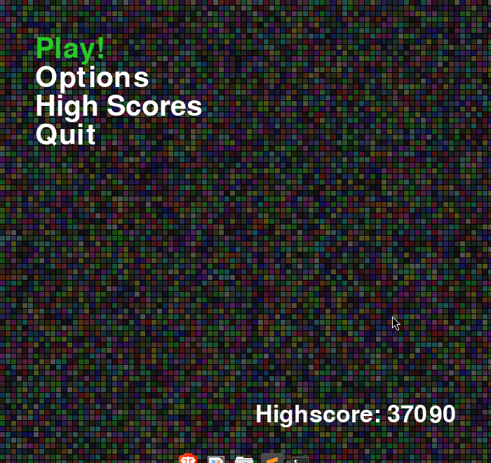
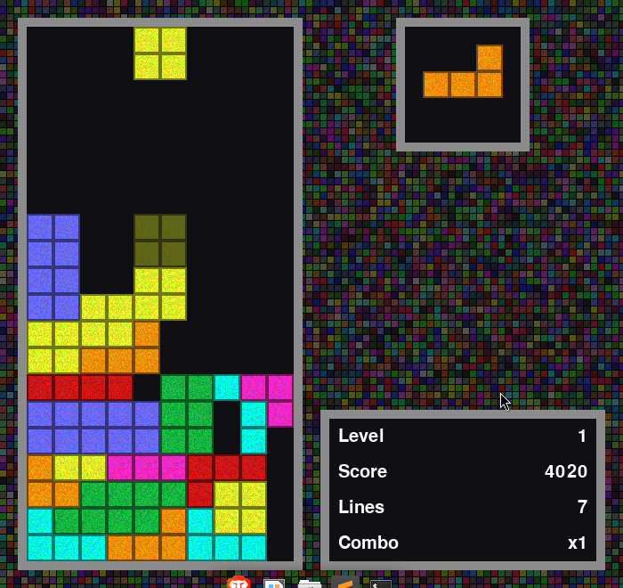

# Tetris

A classic Tetris game implementation in Python using Pygame.

## Features

- Classic Tetris gameplay with all standard pieces (tetrominoes)
- Score tracking with high score persistence
- Increasing difficulty levels
- Smooth piece movement and rotation
- Shadow piece preview
- Pause functionality
- Professional menu system with multiple options
- Full sound system with background music and sound effects
- Menu system with keyboard and mouse controls

## Visuals





## Installation

Make sure you have Python 3.11+ installed, then:

```bash
# Clone the repository
git clone https://github.com/Onehand-Coding/Tetris
cd Tetris

# Install with uv (recommended)
uv sync

# Or install with pip
pip install -e .
```

## Usage

```bash
# Run with uv
uv run tetris

# Or if installed with pip
tetris
```

## Controls

- **Arrow Keys / WASD**: Move and rotate pieces
  - Left/Right or A/D: Move piece left/right
  - Up or W: Rotate piece
  - Down or S: Soft drop (faster descent)
- **Space**: Hard drop (instant drop)
- **P**: Pause/unpause game
- **Escape**: Return to menu from game
- **Mouse**: Navigate menus

## Menu Options

The game now features a professional menu system with the following options:
- **Play!**: Start a new game
- **Options**: Access game options (sound controls, key bindings)
- **High Scores**: View the current high score
- **Quit**: Exit the game

## Sound System

The game includes a full sound system with:
- Background music that loops continuously
- Sound effects for all game actions:
  - Piece movement (left/right)
  - Piece rotation
  - Line clearing
  - Hard drop
  - Level up
  - Game over
  - High score achieved
  - Tetris (4 lines cleared)
- Sound controls available in the options menu

## Development

This project uses modern Python tooling:

- **uv** for dependency management
- **Hatch** for building and publishing
- **Ruff** for linting
- **Black** for code formatting

```bash
# Install development dependencies
uv sync --dev

# Run linting
hatch run lint:all

# Format code
hatch run lint:fmt

# Run tests (when available)
hatch run test
```

## License

This project is licensed under the MIT License - see the LICENSE file for details.

## Attribution Notice

**Important**: The core game code in this repository is not originally mine. I downloaded this Tetris implementation several years ago when I was learning Python, but I have since forgotten the original author/source. 

**If you are the original author or know who created this code, please contact me so I can provide proper attribution and credit.** I want to ensure the original creator gets the recognition they deserve.

What I have done:
- Modernized the project structure to use current Python packaging standards
- Added uv/Hatch build system configuration
- Reorganized code into a proper src layout
- Added error handling for missing resources
- Created packaging configuration and documentation
- Integrated full sound system with background music and sound effects
- Implemented professional menu system with multiple options

## Credits

- **Original Tetris game concept**: Alexey Pajitnov
- **Original Python implementation**: **Unknown author** - *Please contact me if this is your code!*
- **KezMenu library**: Used for menu functionality (included in src/kezmenu/)
